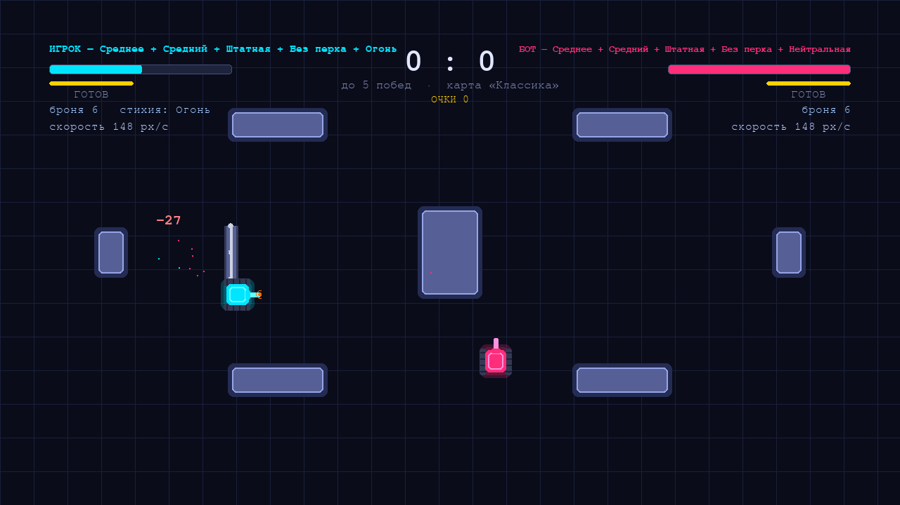

# DUEL — танковая дуэль

Неоновая аркадная дуэль 1 на 1: вы против бота. Соберите свой танк из ПЯТИ
частей — шасси, корпуса, дула, перка и СТИХИИ: 6750 комбинаций, у каждой своя
цена. Стихия (огонь, вода, земля, ток, воздух, лёд, яд, вампиризм) заряжает
каждый ваш снаряд — и НИКОГДА не действует на самого стрелявшего. В ангаре
можно сыграть в ЖРЕБИЙ: проклятья ослабляют ТОЛЬКО ВАС, но каждое ДОБАВЛЯЕТ
+15% очков (можно взять все 8); за них открываются облегчения, которые режут
общий счёт. На врага можно навесить дебаффы (режут счёт) или БАФФЫ — они
наоборот ДОБАВЛЯЮТ очки: усиленный враг платит. За матч капают ОЧКИ, а лучшие
10 забегов попадают в ТАБЛИЦУ СЧЕТА (клавиша T) — она хранится на диске и
переживает закрытие игры. Комбо «Лазер + Веер» стреляет ЛАЗЕРНЫМ ВЕЕРОМ.
Шесть дул (дробовик, пулемёт, гаубица…), перк «Рикошет» (+2 отскока), десять
арен, 10 бонусов, 5 раундов до победы. Наведите мышь на любую карточку —
вылезет ПОДСКАЗКА, что она делает. Написано на Python + Pygame, звуки
генерируются кодом — никаких файлов ресурсов.



## Как запустить на Windows 10

1. Установите Python 3.10+ (лучше 3.12) с [python.org](https://www.python.org/downloads/)
   — при установке обязательно поставьте галочку **Add Python to PATH**.
2. Скачайте этот репозиторий: зелёная кнопка **Code → Download ZIP**, распакуйте.
   (Или через git: `git clone https://github.com/pinokio240/Duel_Game.git`)
3. Откройте командную строку в папке проекта и выполните:

```bat
pip install -r requirements.txt
python main.py
```

## Запуск в один клик — PLAY.bat (самый простой способ)

1. Скачайте репозиторий (зелёная кнопка **Code → Download ZIP**), распакуйте.
2. Откройте папку и **двойным кликом** запустите **PLAY.bat** — он сам найдёт
   Python, при первом запуске установит pygame и numpy и запустит игру.
3. Если увидите «Python не найден» — установите Python с
   [python.org](https://www.python.org/downloads/) (галочка **Add Python to
   PATH**) и запустите PLAY.bat снова.
4. Консольное окно закрывать не нужно — это и есть игра. Закроется вместе с ней.

## Как обновить игру

**Способ 1 — UPDATE.bat (один клик):** запустите **UPDATE.bat** в папке игры.
Он умный: если игра склонирована через git — делает настоящий `git pull`,
а если git нет — сам скачивает ZIP с GitHub и обновляет файлы поверх старых.
Ваша статистика (`duel_stats.json`) сохраняется.

**Способ 2 — вручную:**
1. **Code → Download ZIP** → распакуйте в новую папку.
2. Если хотите сохранить статистику — скопируйте `duel_stats.json`
   из старой папки в новую.
3. Запустите там **PLAY.bat**. Старую папку можно удалить.

**Способ 3 — через git (если git у вас работает):**
```bat
cd D:\Duel_Game
git pull
```

Версия игры показана в главном меню внизу справа (сейчас v2.0).

## Как открыть PowerShell и запустить игру

**Способ 1 (самый быстрый):** откройте папку с игрой в Проводнике, зажмите
**Shift**, щёлкните правой кнопкой мыши по пустому месту в папке и выберите
**«Открыть окно PowerShell здесь»** (или «Открыть в Терминале»).

**Способ 2:** нажмите **Win + X** и выберите **Windows PowerShell**.

**Способ 3:** нажмите **Win + R**, введите `powershell`, нажмите Enter.

Дальше в открывшемся окне PowerShell:

```powershell
# 1) перейти в папку с игрой (подставьте СВОЙ путь)
cd C:\Users\Имя\Downloads\Duel_Game-main

# 2) один раз установить зависимости
pip install -r requirements.txt

# 3) запустить игру
python main.py
```

Если пишет «python не является командой» — попробуйте `py main.py`
(это тот же Python, просто другой ярлык). Если Python вообще не найден —
переустановите его с галочкой **Add Python to PATH** и откройте PowerShell заново.

Если PowerShell ругается «выполнение сценариев отключено» — это нужно только
для виртуальных окружений, лечится так:
`Set-ExecutionPolicy -Scope CurrentUser RemoteSigned` (один раз, это безопасно).

## Управление

| Клавиша | Действие |
|---------|----------|
| W / S   | вперёд / назад |
| A / D   | поворот влево / вправо |
| Пробел  | выстрел (или лазер, если есть заряды) |
| **Q**   | поставить **стену-барьер** (если есть заряд «Б») |
| **E**   | положить **мину** под себя (если несёте мину) |
| Esc     | пауза: Esc — продолжить, A — в ангар, M — меню |

В ангаре всё можно выбирать **КЛИКОМ МЫШИ**: клик по карточке шасси/корпуса/дула/перка/стихии — выбрать её, клик по карте жребия — взять/снять, клик по эффекту — навесить на врага. Кнопки «В БОЙ», «МЕНЮ», «В АНГАР», «ТАБЛИЦА СЧЕТА» и все кнопки паузы/конца матча тоже нажимаются мышью.

**ПОДСКАЗКИ:** наведите курсор на любую карточку (хоть на «Лёгкое» шасси) —
вылезет окошко с описанием КРУПНЫМ шрифтом: что деталь делает, её цены в
уроне/скорости/очках и взята ли она. Мелкий шрифт на карточках читать не нужно.

Клавиатура тоже работает: **A/D** — шасси, **W/S** — корпус, **Q/E** — дуло, **Z/C** — перк,
**F/G** — стихия, **R/T** — курсор по жребию, **V** — взять/снять карту жребия,
**B/N** — курсор по эффектам на врага, **M** — взять/снять эффект,
**Enter** — в бой. В главном меню: **1/2/3** — сложность бота,
**T** — таблица счёта (и с экрана конца матча тоже).

## Собери свой танк: 6750 комбинаций

Перед боем выбираются ПЯТЬ деталей. У танка нет «имба»-сборки — у всего своя цена.

### Шасси — определяет скорость и поворот

| Шасси | Скорость | Поворот | Бонус | Особенность |
|-------|----------|---------|-------|-------------|
| Лёгкое    | 220 px/с | 250 гр/с | — | — |
| Среднее   | 175 px/с | 200 гр/с | броня 6 | — |
| Тяжёлое   | 125 px/с | 155 гр/с | броня 12 | — |
| Спортивное | 240 px/с | 270 гр/с | — | вес корпуса давит ×1.3 |
| Вездеход  | 150 px/с | 175 гр/с | броня 9 | вес корпуса давит всего ×0.5 |

### Корпус — определяет прочность (HP) и вес

| Корпус | HP | Вес (замедление) | Перезарядка |
|--------|----|------------------|-------------|
| Лёгкий   | 70  | 0%  | 0.55 с |
| Компакт  | 90  | 8%  | 0.50 с |
| Средний  | 110 | 15% | 0.70 с |
| Броневик | 135 | 25% | 0.75 с |
| Тяжёлый  | 160 | 35% | 0.85 с |

### Дуло — что и как стреляет

| Дуло | Обойма | Урон | Скорость снаряда | Цена |
|------|--------|------|------------------|------|
| Штатная | 1 снаряд | 30 | 540 px/с | — |
| Спарка | **2 снаряда** подряд | 30 | 540 px/с | танк медленнее на 12%, полная перезарядка ×1.9 |
| Дальняя | 1 снаряд | **42** | **702 px/с** | перезарядка ×1.5 |
| Дробовик | **залп 5 дробин** | 15 за дробину | 540 px/с | перезарядка ×1.35, разброс ±11° |
| Пулемёт | **6 снарядов** очередью | 15 | 567 px/с | перезарядка ×1.6, танк медленнее, разброс ствола ±3° |
| Гаубица | 1 снаряд | **60 (крупный)** | 459 px/с | перезарядка ×2.1, танк еле ползёт (×0.8) |

Спарка — два снаряда в обойме (индикатор «ОБОЙМА 2/2» в HUD). Дальняя —
снайперская: снаряд крупнее, быстрее и больнее. Дробовик — король ближнего
боя: все 5 дробин в упор дают до 75, но по дальним целям мажет. Пулемёт —
косит очередями, каждый снаряд лёгкий. Гаубица — два попадания разваливают
средний танк, но выстрел редкий и медленный.

### Перки — одна особенность со своей ценой

| Перк | Польза | Цена |
|------|--------|------|
| Без перка | — | — |
| Гонец | **+25% скорости** | **прочность −25%** (быстрый, но защита снижена) **и ослабленное турбо**: бонус «У» даёт +20% вместо +60% |
| Панцирь | **+25% прочности** | **−15% скорости**, разворот вялее |
| Стрелок | **перезарядка −20%** | разворот −15% |
| Рикошет | **+2 отскока каждому снаряду** (всего 3) — бей из-за угла | **прочность −15%** |

**Про рикошеты:** базовый снаряд отскакивает от стен 1 раз. С перком «Рикошет»
— уже 3 раза: можно закинуть снаряд за угол или за стену врага. Помните:
вернувшийся рикошетом снаряд может ударить и по вам (урон — да, стихия — нет).

**Закон баланса:** итоговая скорость = скорость шасси × (1 − вес корпуса ×
чувствительность шасси) × множитель дула × множитель перка. Тяжёлое
шасси + тяжёлый корпус = 81 px/с — сарай. А «Вездеход» с тем же корпусом
уже 124 px/с — вот зачем он нужен. Наглеть нельзя:
броня = медлительность, скорость = хрупкость.

Итоговый урон снаряда = 30 × множитель дула × множитель стихии
(42 у «Дальней», 33 у «Нейтральной», 22 у «Огня»). Броня снижает урон,
но не меньше 5 за попадание. Текущая скорость показана в HUD у каждого танка.

**Правило турбо:** без перка на ускорение бонус «У» работает как обычно
(+60% на 4 сек). Но если у вас перк «Гонец», турбо ускоряет слабее (+20%) —
чтобы скорость и турбо не складывались в ракету и танк не летал по карте.

### Стихия — заряжает КАЖДЫЙ ваш снаряд (F / G в ангаре)

Стихия — это не бонус с земли, а часть сборки: работает весь матч, каждым
выстрелом. За эффект стихии платите частью урона. Срез ствола светится
цветом стихии — видно, чем стреляет и бот тоже.

| Стихия | Эффект при попадании | Цена |
|--------|----------------------|------|
| Нейтральная | — | снаряд крепче: **урон ×1.1** (33) |
| Огонь | поджигает: 4 сек урона (6/с), **броня не спасает** | урон ×0.75 (22) |
| Вода | смывает с врага ВСЕ бонусы и щит, враг буксует 1.2 с | урон ×0.65 (20) |
| Земля | враг вязнет: скорость ×0.45 на 2.5 сек | урон ×0.8 (24) |
| Ток | глушит мотор врага (скорость и разворот ×0.5) на 1.3 сек | урон ×0.7 (21) |
| Воздух | отшвыривает врага на 90 px, снаряд летит ×1.2 быстрее | урон ×0.8 (24) |
| Лёд | **вмораживает врага** (обездвиживает) на 0.9 сек | урон ×0.7 (21) |
| Яд | травит: 5 сек по 5 урона/с, **броня не спасает** | урон ×0.7 (21) |
| Вампиризм | **лечит вам 40% урона** каждого попадания | урон ×0.65 (20) |

**ПРАВИЛО СВОЕЙ СТИХИИ:** земля, ток, вода, лёд и яд НИКОГДА не действуют
на того, кто выпустил снаряд. Отскочивший рикошетом свой снаряд снимет у вас
HP, но НЕ замедлит, НЕ подожжёт и НЕ отравит — сам себя замедлять больше
не получится.

Подсказки: Огонь — против «Панцирей» и тяжёлой брони; Вода — сорвать врагу
турбо/щит/лазер; Ток — остановить «Гонца»; Воздух — столкнуть врага в стену
или на чужую мину; Лёд — прервать пулемётную очередь; Яд — врагу со щитом;
Вампиризм — для затяжной возни в упор. У бота стихия тоже своя — смотрите HUD.

## 10 бонусов в бою

Бонусы появляются на арене каждые ~7 секунд (до 5 сразу). Стихии здесь больше
нет — она теперь выбирается в ангаре:

| Знак | Бонус | Эффект |
|------|-------|--------|
| Щ (синий) | Щит | получаемый урон ×0.4 на 5 сек |
| В (жёлтый) | Веер | 3 выстрела тройной очередью; вместе с «Лазером» — **ЛАЗЕРНЫЙ ВЕЕР** |
| У (зелёный) | Турбо | **+60%** скорости на 4 сек; с перком «Гонец» — всего **+20%** |
| + (красный) | Ремонт | +40 к прочности |
| М (оранжевый) | Мина | несётся в боекомплекте; **E** — положить под себя; врагу ближе 110 px не даст |
| Л (фиолетовый) | Лазер | +2 заряда: мгновенный луч вместо снаряда; вместе с «Веером» — **ЛАЗЕРНЫЙ ВЕЕР** |
| Д (серый) | Дым | завеса на месте танка: бот сквозь неё не видит 6 сек |
| С (бирюзовый) | Скорострел | перезарядка ×2.2 быстрее на 5 сек |
| Э (ледяной) | ЭМИ | обездвиживает врага на 2.5 сек |
| Б (стальной) | **Стена** | заряд барьера; **Q** — поставить перед собой |

**Стена-барьер:** 120 прочности, через неё нельзя проехать и не пролетит
снаряд (снаряды её ломают). Стоит 30 сек или пока не разбьют. Бот тоже
умеет отгораживаться — пробивайте стену или обходите.

### Лазерный веер — комбо «Лазер» + «Веер»

Раньше эти бонусы не соединялись — теперь всё честно: если у вас ОДНОВРЕМЕННО
есть заряды лазера и выстрелы веера, выстрел лазером превращается в
**ЛАЗЕРНЫЙ ВЕЕР** — три мгновенных луча веером (0°, ±14°). Тратится 1 заряд
лазера и 1 выстрел веера. Каждый луч веера бьёт на 26 (вместе до 78 —
но попасть всеми тремя трудно), одиночный лазер остаётся как был — 35.
В HUD это видно: «ЛАЗЕРНЫЙ ВЕЕР 2/3». Бот тоже умеет этим пользоваться,
если соберёт оба бонуса.

**Мина по кнопке:** подобрали «М» — мина лежит в боекомплекте (видно в HUD:
«МИНА x1 (E)»). Нажали E — мина легла прямо под вас. Ставить можно только
в 5 клетках от себя (то есть всегда — она ваша), но НЕ во врага: если враг
ближе 110 px, игра скажет «ВРАГ РЯДОМ!» и не даст подорвать себя же.

Хитрости: дым спасает от снайпера, мина — ловушка у прохода, лазер бьёт
мгновенно (не нужно ждать полёта снаряда), ЭМИ — идеальное добивание.

## Жребий: проклятья и облегчения (клик или R / T / V)

Шестой ряд ангара — жребий: 8 проклятий (красные карты) и 8 облегчений
(зелёные). **R/T** двигают курсор, **V** берёт/снимает карту. Правила
по ТЗ игрока:

- **Проклятья ослабляют ТОЛЬКО ВАС, но каждое ДОБАВЛЯЕТ +15% очков** —
  риск должен окупаться.
- **Облегчения помогают вам, но каждое режет общий счёт за забег на 10%.**
- **Без проклятий можно взять максимум ОДНО облегчение.**
- Каждое взятое проклятье открывает ещё одно облегчение. Сняли проклятье —
  лишние облегчения снимаются сами.
- **Лимит v2.0: можно взять ВСЕ 8 проклятий и ВСЕ 8 облегчений** — с полным
  набором проклятий потолок облегчений становится 9.
- Итоговый множитель виден в ангаре и в HUD (не ниже x0.30).

| Карта | Тип | Эффект |
|-------|-----|--------|
| Хрупкость | проклятье | прочность −25% |
| Ржавые гусеницы | проклятье | скорость −15% |
| Разбитый прицел | проклятье | снаряды разбрасывает на 7° |
| Долгая перезарядка | проклятье | перезарядка +25% |
| Кривые снаряды | проклятье | урон снарядов −15% |
| Сырой порох | проклятье | снаряды летят медленнее |
| Разболтанные гусеницы | проклятье | разворот вялый |
| Текущий бак | проклятье | турбо слабее |
| Укрепление | облегчение | прочность +25% |
| Форсаж | облегчение | скорость +15% |
| Отточенный ствол | облегчение | перезарядка −20% |
| Дальний бой | облегчение | снаряды летят на 15% быстрее |
| Заточенные снаряды | облегчение | урон снарядов +15% |
| Юркость | облегчение | разворот +15% |
| Гоночный бак | облегчение | турбо сильнее |
| Твёрдые руки | облегчение | разброс −3° (лечит «Разбитый прицел») |

Жребий действует ТОЛЬКО на вас — бот ездит без него. В ангаре итоговые
характеристики пересчитываются сразу: видно, во что превращается танк.

## Эффекты на врага: баффы и дебаффы боту (клик или B / N / M)

Можно навесить на бота и ослабления, и усиления — но цена ПРОТИВОПОЛОЖНАЯ:
**дебафф режет общий счёт за забег (−10%), а бафф врагу НАОБОРОТ ДОБАВЛЯЕТ
очки (+10%..+15%)** — усиленный враг платит. **Лимит v2.0: до 8 эффектов
разом** (в колоде 6 дебаффов и 6 баффов); облегчений они НЕ открывают —
открывают только проклятья. Баффы подсвечены зелёным, дебаффы — рыжим.

| Карта | Тип | Эффект | Цена |
|-------|-----|--------|------|
| Ослабить врага | дебафф | враг теряет 15% прочности | −10% очков |
| Саботаж врага | дебафф | враг медленнее на 15% | −10% очков |
| Износ ствола врага | дебафф | враг перезаряжается дольше | −10% очков |
| Ржавые гусеницы боту | дебафф | враг ворочается еле-еле | −10% очков |
| Мутный прицел боту | дебафф | враг мажет по краям (+6° разброса) | −10% очков |
| Сырой порох боту | дебафф | снаряды врага ползут | −10% очков |
| Закалить врага | бафф | враг прочнее на 25% | +10% очков |
| Нитро врагу | бафф | враг быстрее на 15% | +10% очков |
| Ас за пультом | бафф | враг стреляет чаще | +10% очков |
| Толстые снаряды боту | бафф | враг бьёт больнее | +10% очков |
| Гоночный бак боту | бафф | турбо врага рвёт тросы | +10% очков |
| Берсерк врагу | бафф | враг в ярости: крепкий и злой | +15% очков |

Смелый план: взять все 8 проклят (+120%) и 4 баффа врагу (Берсерк + Нитро +
+ Ас + Закалка = +45%) — забег за x2.65 против ОЗВЕРЕВШЕГО бота на лимите
эффектов. Трусишка, наоборот, мажет боту прицел и сыплет сырой порох —
но счёт режется.

## Очки и ТАБЛИЦА СЧЕТА

За матч (забег) капают очки:

| Действие | Очки |
|----------|------|
| Урон врагу | 1 за каждую единицу снятого HP (снаряды, лазер, мины, пожар) |
| Подбор бонуса | +5 |
| Победа в раунде | +100 (ничья +30) |
| Победа в матче | +300 |

Итог за забег = сырые очки × множитель жребия: проклятья ДОБАВЛЯЮТ +15%
каждое, облегчения режут на 10%, дебаффы врага режут, баффы врагу
добавляют — по своей цене на карте.
Живой счёт виден в HUD под счётом раунда («ОЧКИ 123 · жребий x1.30»),
итог — на экране конца матча.

**ТАБЛИЦА СЧЕТА** (клавиша **T** в меню или с экрана конца матча) — топ-10
забегов: очки, результат, счёт раундов, взятый жребий, множитель, стихия и
дата. Каждое завершение матча попадает в таблицу; тройка лучших подсвечена
золотом/серебром/бронзой, ваш свежий забег помечен «← ваш забег», рекорд
— «НОВЫЙ РЕКОРД!». Таблица хранится в `duel_stats.json` и пишется на диск
СРАЗУ после каждого матча — **закрытие игры её не трёт**, как и статистику
побед/поражений (дополнительно игра сохраняется при выходе через крестик).
Обновление игры (UPDATE.bat) таблицу тоже сохраняет.

## Снаряды и рикошеты

Снаряд один раз рикошетит от стен и препятствий — можно стрелять «из-за угла».
От своего же снаряда в первые мгновения вы защищены, но вернувшийся рикошетом
снаряд может ударить и по вам (урон — да, своя стихия — НЕТ, см. выше).
Перк «Рикошет» даёт каждому снаряду **+2 отскока** — всего 3.

## Арены, матч, бот

- **10 арен**: Классика, Крестовина, Колонны, Уголки, Полоса, Соты, Мосты,
  Бункер, Веер, Шахты — случайная на каждый матч, название видно в заставке
  раунда и в HUD.
- Матч = раунды до **5 побед**; при одновременном подрыве — ничья.
- Бот каждый матч получает **случайную сборку** (шасси + корпус + дуло + перк
  + стихия) — смотрите в HUD, кто к вам приехал.
- **Бот прокачан**: обходит препятствия по ширине танка (узкие щели сразу
  объезжает, а не долбится), **собирает бонусы** (ремонт на низком HP,
  щит, лазер — и не дарит их вам, если вы ближе), кидает **мины под
  догоняющего** и строит **стены** между собой и вами.
- **Сложность бота** (в меню, клавиши 1/2/3): Лёгкий / Норм / Хардкор —
  меняется меткость, скорость реакции и дальность уклонений.
- Статистика матчей (победы/поражения/ничьи) сохраняется в `duel_stats.json`
  и показывается в меню.

## Настройка баланса

Все цифры вынесены в `settings.py` — скорость, урон, дулы, перки, бонусы,
стихии, жребий, очки, сложность, палитра. Меняйте и экспериментируйте,
код трогать не нужно.

## Структура проекта

```
main.py        — точка входа
PLAY.bat       — запуск в один клик (Windows): ставит зависимости и стартует игру
UPDATE.bat     — обновление в один клик: качает свежую версию с GitHub
settings.py    — весь баланс: шасси, корпуса, дулы, перки, стихии, стены
game.py        — состояния игры, барьеры, мины, ангар (5 панелей + жребий + враг), очки, таблица счёта, HUD
tank.py        — танк: движение, обоймы, перки, стихии, жребий, поджог
bullet.py      — снаряды, рикошеты и элементальные заряды
bot.py         — ИИ бота: обход щелей, сбор бонусов, мины и стены
arena.py       — 10 арен, стены, коллизии, динамические барьеры
powerup.py     — 10 бонусов + мины
effects.py     — частицы, взрывы, лазерные лучи, тряска камеры
sound.py       — звуки, синтезируемые numpy
```

## Идеи для развития

- Второй игрок за одним ПК (стрелки + Enter)
- Ракетница с самонаведением, электромагнитный разгон снарядов
- Еженедельные сиды-испытания с фиксированной ареной и жребием

## Лицензия

MIT — см. [LICENSE](LICENSE).
